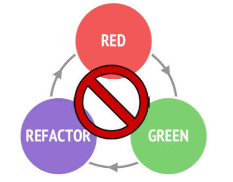
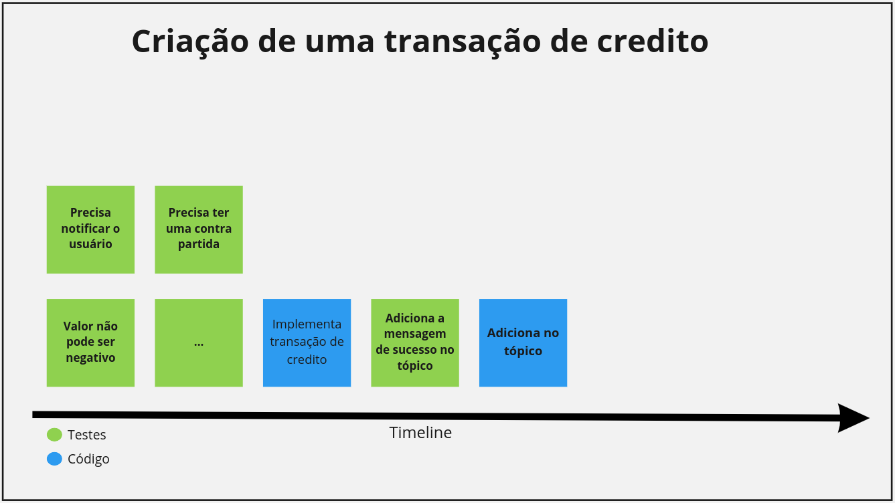
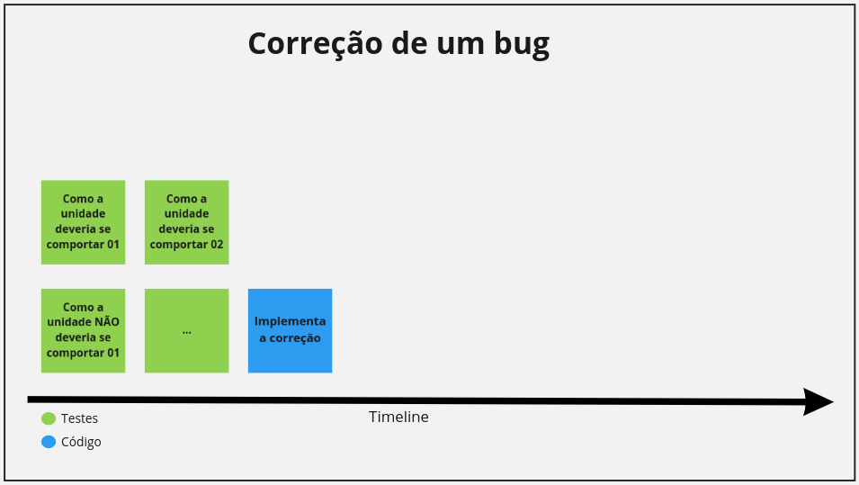

### TDD - Test Driven Developmen

#### (Do Jeito Errado)

{width=50%}

---

#### Não é uma apresentação By The Book ⚠️

{width=33%}

---

### O que é TDD

{width=60%}

---

### Por que?

- Melhor qualidade do código
- Encontrar Bugs antes(R$)
- Encontrar problemas das regras de negócio
- Documentação viva
- ...

---

### TDD - Do Jeito ERRADO

---

### Porque eu não curto tanto

---

---

### Muito lento

{width=60%}

---

### Como eu faço?

---

### Em caso de bugs

---

### Dúvidas?

---

### O que é BDD

---

### DDD vs. DBB vs. TDD

---

### Qual a ideia

- Eu mostrar um exemplo
- Pair programming

---

### Problemas que vamos resolver

{width=40%}

#### [Diagrama - Virtual Wallet](https://miro.com/app/board/uXjVOJUpVm0=/)

---

### BDD

{width=70%}
